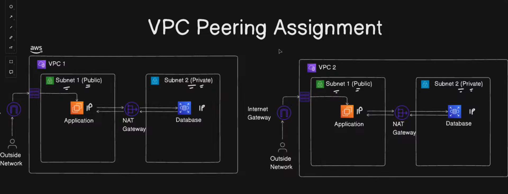

# AWS VPC Peering Project (Hands-On Lab)

This repository documents an AWS networking project where I built **two VPCs** and connected them using **VPC Peering** to enable private communication between isolated networks.

## Architecture Diagram

## What I Built
- Two VPCs with non-overlapping CIDR blocks
- Public + Private subnets in each VPC
- Internet Gateway + NAT Gateway
- EC2 instances (application/database simulation)
- VPC Peering connection
- Route table updates for cross-VPC traffic

## Key AWS Services
- VPC
- Subnets
- Route Tables
- Internet Gateway
- NAT Gateway
- VPC Peering
- EC2
- Security Groups

## Proof / Screenshots
See: `screenshots/`

## Setup Guide
Step-by-step guide: `documentation/setup-guide.md`

## Learning Outcomes
- Cloud networking fundamentals (CIDR, routing, segmentation)
- Secure architecture with public/private subnets
- Cross-VPC connectivity using VPC Peering
- Debugging routing + security group issues

## Test Result
-Connectivity validated via ICMP across VPC peering
-Route tables updated on both VPCs
-Security group allowed ICMP from peer CIDR
